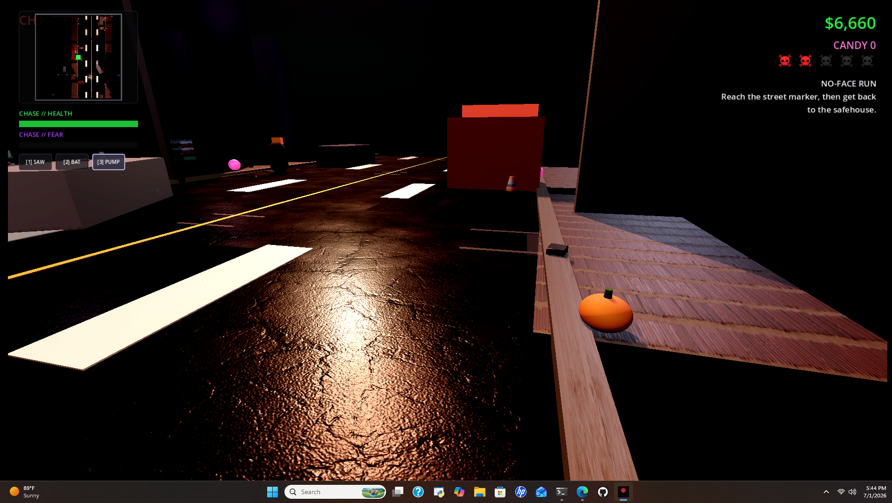

<p align="center">
  
</p>

<p align="center">
  
</p>

<p align="center">
  <a href="https://dacameragirl.github.io/Chases_Halloween_Heat_Realism/"></a>
  <a href="https://github.com/DaCameraGirl/Chases_Halloween_Heat_Realism"></a>
  
  
</p>

<p align="center">
  
</p>

<p align="center">
  <strong>Grounded lighting.</strong> <strong>Cleaner framing.</strong> <strong>Built for the real Chase pipeline.</strong>
</p>

<p align="center">
  
</p>

## Why This Repo Exists

This is the realism-first companion to the parody build. It keeps the same Halloween chase premise, but the code and asset structure are meant for a more grounded visual direction.

## What This Branch Is For

- More realistic lighting and scene framing
- A cleaner modular browser game structure
- A place to grow a better-looking Chase without breaking the parody branch
- A home for the future custom 3D Chase character

## Current State

- Third-person browser prototype
- Realism branch HUD and mission route
- Starter stand-in character
- Environment and camera set up for a more grounded look
- A clean place to swap in a true Chase model later

## Plain-English Model Note

Right now the game uses a temporary stand-in character.

Later, this branch can be upgraded with a real custom 3D Chase model. The code is already organized so that when that model exists, it can replace the stand-in without rewriting the whole project.

## Repo Layout

- `index.html` boots the realism build
- `css/styles.css` styles the HUD and overlay
- `js/main.js` runs movement, camera, HUD, and the game loop
- `js/world.js` builds the neighborhood and objective markers
- `js/character.js` handles the current stand-in character and future model loading
- `docs/PIPELINE.md` explains the realism upgrade path
- `docs/CHASE_GLB_PIPELINE.md` covers the real `chase.glb` workflow
- `assets/models/chase.config.json` lets you tune model import scale/origin/rotation without editing code

## Language Bar

```text
JavaScript  [#############-------]  52%
HTML        [########------------]  30%
CSS         [#######-------------]  18%
```

## Controls

- `WASD` move
- `Shift` sprint
- `Right drag` orbit camera
- `R` reset Chase to spawn

## Run Local

```powershell
py -3.11 -m http.server 8022
```

Open:

```text
http://127.0.0.1:8022/
```

## Live URL

```text
https://dacameragirl.github.io/Chases_Halloween_Heat_Realism/
```

## Reality Check

This branch is the right place to aim for a more believable Chase, but it still needs a real custom character asset before it can get anywhere near GTA-style likeness. The parody repo is for speed and style. This repo is for the long game.

## Next Upgrade Path

1. Improve the starter stand-in
2. Build or import a custom Chase model
3. Tune materials, curls, face proportions, and hoodie shape from photo references
4. Push this branch toward the more realistic version of the game

<p align="center">
  
</p>
